# 剑侠情缘2 白金版！！-----南宫飞云 二十门 绝技[排名]

*[@wcy0236](https://tieba.baidu.com/home/main?id=tb.1.61e25647.bxcx0H-ap9QisdFpZ672mw)*

## 1楼

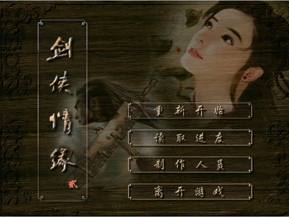 突然想起，这几天又玩了一把这款经典的游戏~剑侠情缘2 白金版。 虽然当初玩这款游戏的时候，当时还在读小学。 不过想起这款游戏，在我的记忆当中是一款非常经典好玩的游戏。 充满了美好的回忆~ 记得当时 玩的是简单的难度，好像最后玩出来的是悲剧的结局~~ 为此难过好几天，后来才知道可以有完美绝句滴。 这几天玩了把困难模式~轻松过关，确实很不错~ 所以在此也研究了一番，南宫飞云 所练的这些功夫，哪些能称的上是绝世武功~

## 2楼

各位不好意识，昨天一时兴奋挖了个坟贴。 掉坟坑里面去了~ 今天开始继续更新，可能前期更新会比较慢一点。（大家不要急） 为了更好的品质和交流的机会，所以排名结果会最后列出来。 希望能够让大家都满意，所以会一边交流一边详细的去写 南宫飞云二十门武学的精髓~ 可以参考大家的意见！~ (挖坟偿命 ） 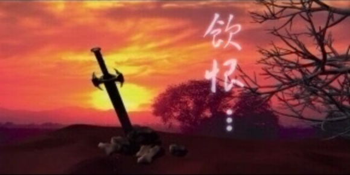

## 3楼

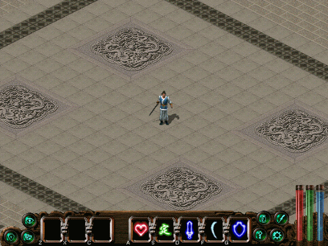白虹贯日~~，对没错！为什么会第一个说到她呢？ 虽然白虹贯日并不是什么武林里面多么绝顶的神功~ 但它的功劳是非常大的，哪怕是武林里面绝顶的高手也是他必修的武功。 大家都知道，当身体受到强烈的攻击以后.... 即使是使用仙丹妙药也需要一定的时间才能完全修复体内的创伤。 所以当务之急，在很恶劣的环境当中（你只有很短暂的时间）， 这个时候你只能通过内力进行运气，将“气”游走全身筋络。 从而达到快速治愈伤痛，消耗内力来延续生命~。具有惊人的治愈速度。 在生命之火快熄灭的时候能够起死回生，让热血继续沸腾~ 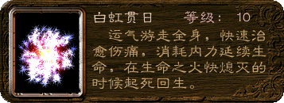 其实在不必要的时候，通常是不会刻意去使用白虹贯日的。 在大量的真气，快速的涌入其奇经八脉当中时，会产生大量的冲击。 其看上去由如 “白虹贯日”一般，顾名思义其名字也是这么由来的。 在江湖上，很多武林人士并不是很乐意去练习它。 原由，白虹贯日之天象并不是吉祥之兆，以其取名的治愈之功也有所贬义。 虽然发功之时由如“白虹贯日”般，可以极速治愈，但也会对身体的经络产生一定冲击。 在加上，跑江湖的并不希望自己碰到这一刻，也希望永远不会用到它。 科普一下 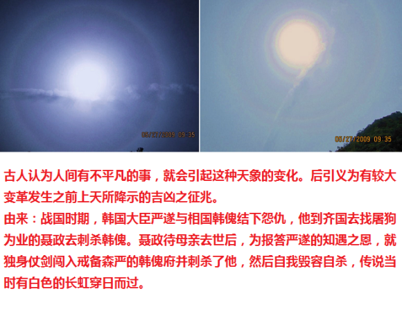

## 4楼

 天意剑诀""，此剑诀是由南宫飞云的父母隐居大漠后，专为飞云独创的剑法。 看似简单明了，但其实深藏不露，颇有一番心意。 其父张如梦、母亲南宫彩虹能够在一起也由如天意！ 用爱来化解双方的仇恨，化解两国的渊源。 张如梦和南宫彩虹也算是一见钟情，但两人都背负着保卫他国的重任。 仇恨是永远化解不了仇恨的，当两人陷入爱的河流当中时却又彼此又陷入了痛苦之中。 最后双方在重任之下来到剑门关，生死一搏。两人剑剑含情，越打越有默契，不忍取人性命。 但重任又如剑门关一样，在广博的大地上划上深深的一剑。 可见一对痴男怨女，爱亦不能，恨亦不能。 但最终"爱"让她们走在了一起，有如天意！~ 剑门关拜天地，从此退隐江湖，隐居漠外，夫妻恩爱自不待言... 两人能够在一起真的是天意啊~~~~ 生下了爱子飞云，张如梦为了让爱妻高兴，让子随母姓，给爱子取名南宫飞云 夫妻二人为爱子独创剑法，为感谢上天能让他们终成眷属喜得爱子。取名天意剑诀~。 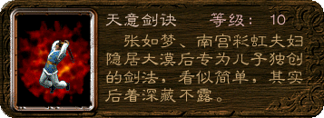 天意剑诀是飞云童年时期所练的武学，看似简单， 但是毕竟是张如梦和南宫彩虹两位武林顶尖高手为儿所创~ 蕴含着很多武学的精髓在里头，虽然并不是什么盖世神功。 但是为云儿练武打下了扎实的根基！~ 随着年龄的增长，对剑意的渗透。也能发挥惊人的威力。 如同秉持天意，刑罚人间众生，让人丧失一切抵抗的信念， 在空中显现出无数飞云的身影，剑到之处，风停雨止。 ======================================================================= 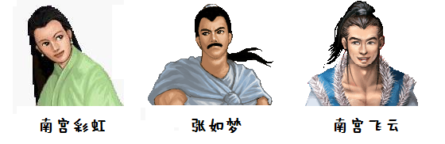

## 5楼

 寒霜掌"",此掌法据说是李白所创~！ “神马？。。。李白也会武功？不会吧~有木有搞戳哦...” 古往今来，人们只晓得李白是一位“斗酒诗百篇”的巨大诗人， 他生平留下900多首诗，篇篇让人沉醉，句句令人叹赏，万口相传，代不停响。 但须知，李白仍是一位武功高强的剑客！ “剑”比“诗”好，这是李白本身的见地。记住了他的“诗”而忘了他的“剑”，这是世人的悲痛，当然也是“不幸”中的万幸…… “少任侠，手刃数人” 李白的《侠客行》“十步杀一人，千里不留行。事了拂袖去，深藏身与名。” 是在写他所钦慕的古时侠客？其实不然，而是在暗写他本身的阅历。 李白25岁时“仗剑去国，辞亲远游”，毫不是为了考科举而离开家乡。其终生未参加过科举考试... 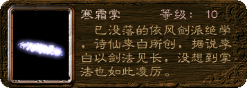 寒霜掌是由黑煞传给南宫飞云的绝学~ 其通过经脉逆行真气，产生至阴至寒的寒气从掌中发出。 由于发出的掌法极具阴寒，当掌力进入他人体内以后， 如果没有及时防范（用炙热的阳刚内力将其逼出），中掌者就会全身寒冷乏力。 此时就算没有取他性命，但也已经全身乏力，任人宰割了。 （在白金版当中是无法修炼白煞的“杀意心法”的，所以在这里就不多做过多的解释了~） 杀意心法通过燃烧真气将其转化为体力~！短时间内激发自己的潜在体能。 ======================================================================= 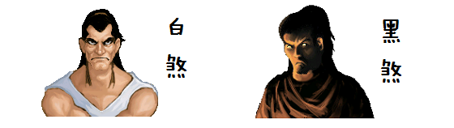

## 6楼

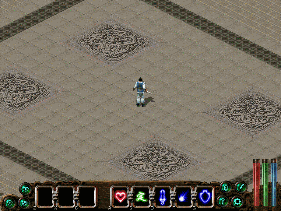 怒雷指“”是南宫飞云打败斗笠大叔自个儿摸索出来的。 “这家伙的功夫挺厉害的，他那招是怎么使得来着.....这样.....这样.....不对.....哈哈 我学会了，这么刚猛的招式就叫怒雷指好了。” 怒雷指属于来历不明的指法，斗笠大叔也被飞云打挂了，所以也无法问这是谁创滴了~ 至于这么厉害的功夫，既然被刚刚离家而出的飞云给干挂了？ 我想，肯定是飞云趁机躲过了怒雷指的攻击，最后将斗笠大叔制服~！ 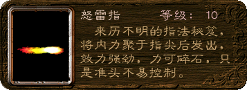 运气将内力聚于指尖，把愤怒从指尖上发出。能产生强劲如雷的威力！~ 起初为三道指力，当每日加以修炼能够达到发出9道强劲的指力！ 由于将过多的愤怒聚集于指尖，导致手心难以把握准心，所发出的指力会有所偏移。 ===================================================================== 有时候打不着，也是情有可原滴~ 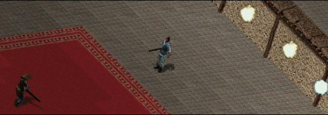

## 7楼

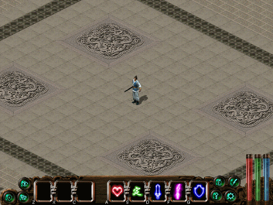 风雪狂刀“”此刀法是由风雪山庄庄主赵升权所创~ 飞云能够有机会修炼此刀法，完全算是飞云的小小机智点化了一下升权大叔。 小仙女（诺雪）在客栈的突然离去，让飞云不知所措。 在一起这么多天，飞云这小子既然还没问过姑娘的名字。这让飞云情何以堪~（上哪儿去找啊@） 询问路人得知小仙女可能是风雪山庄主人的女儿赵无双，随后来到庄上。 为了进去见小仙女，飞云只能冒犯家丁打伤几人进入庄内。 碰上了庄主赵升权，看见大叔使得刀法很强横，连刀都没有用就发出如此强的刀气。 “不过比起我老爹使的天意剑诀还是有一段差距滴。”（那肯定啦！张如梦也不是好惹的） 飞云伤了这么多人 闯进庄里，如果在这样打下去就很难收场了~ 所以飞云有意承让，扛了一刀 风雪狂刀 刀气后便“哎呀好强的刀气啊~” 倒地了。 其实大叔是知道有蹊跷的(大叔人好，没有责怪飞云）， 事后发现赵无双不是自己要找的小仙女~ 但大叔一直想达到心刀的境界~（有点小武痴） 飞云事后和大叔聊天就借此机会点醒了大叔。~“心刀就是无刀，无心即刀”。 其实大叔已经是心刀境界了（刀气伤人），只是一直不理解何为最高境界心刀（纠结了好多年~）。 事后大叔为表感谢送上一“刀”。 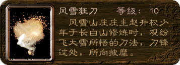 五十一路风雪狂刀，是升权大叔年少时在长白山修炼，观纷飞大雪所悟的刀法！~ 其祖传的风雪神枪更是使得出神入化，曾杀得金人闻风丧胆，所以大叔也不是浪得虚名的。 风雪狂刀，是通过快速运转其体内的真气，瞬间将其化为刀气崩向四方。 由如雪蹦一般 冲向前方，刀锋过处更是无法抵挡~ ====================================================================== 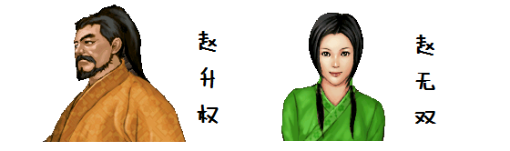

## 8楼

 百步定身法“”是飞云在别离村东北的树林里面 一个宝箱里得到的秘籍~ 为了找诺雪路过别离村，听说树林子近日有不少武林人物出没。 于是飞云就进林子来瞧瞧，发现确实有很多武林人士厮杀在一起~ 貌似是由于前几天一位住在林子里的武林前辈去世了，导致很多武林人士来这林子里。 不知道什么原因打了起来，或许是为了武林秘籍而来的。 在林子里发现一位小男童躲在里面，后来得知武林前辈以前在林子里教孩童们习武！ 前几天，前辈在临终前把一把金光闪闪的钥匙送给了男童。 由于飞云安全的把男童带回了村子里，男孩很感激，所以就把钥匙送给了飞云~ 回到林子，飞云找到了一个隐秘的宝箱。里面既然是一本武林秘籍《百步定身法》。 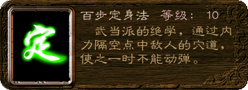 百步定身法可以说是不可多得的武林绝学，也是我们通常所说的隔空点穴法~ 通常我们的实物点穴，对于武林人士来讲算不上什么。 一般情况下，想靠近对方直接点住穴道是很困然的。 所以隔空点穴在对手放松警惕的时候，通过手指聚集内力，将一道指气击中对方的穴道。 使其麻木失去知觉而动荡不已~ 但对于内力深厚，武功高强的人来说。可以通过真气 内息流转 来恢复自由！~ 所以只有当百步定身法的修炼者，“指气”达到一定境地的时候，才能持久的制约于人。 通常在身中百步定身法后，如果不能及时解穴。那么可以直接宣布其 ——KO 了。 ========================================================================== 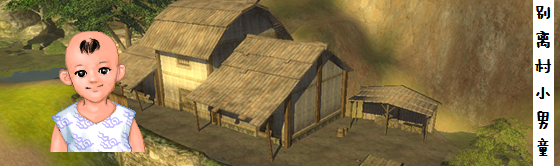

## 9楼

 漫天花雨手法“”是唐门的绝技，非常霸道的暗器手法！ 飞云咐秋依水所托，把唐影的定情信物送回给他。 飞云闯入唐门被唐离的漫天花雨击中，接了十八招就倒地了~（飞云还是挺强滴） 事后把信物交给了唐影（“这下好了，依水姑娘都死心了”你们现在高兴了吧！） 飞云不忿之下大胆放言，以自己父母的故事点化唐离，成全了唐影和秋依水的亲事。 其实对于说服唐离老爷子来讲，我想更多的是唐离佩服飞云的身手不凡。 年纪轻轻能接住老爷子十八招~！ 随后，唐影为了感激飞云帮忙说服了老爹唐离，成全了他和秋依水的亲事。 就把漫天花雨传授给飞云了，得到《漫天花雨》秘笈~ 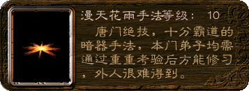 漫天花雨并不是直接使用的功夫，而是一种手法！ 可以通个这种手法，运气将内力聚集于暗器上，快速出击给敌人致命一击~ 当熟练掌握这种手法以后，可以一次性击出更多的暗器，就如漫天花雨一般。 漫天花雨手法，可以使用针、刀、镖这些物品作为暗器来使用， 对于女子甚至可以使用独特的琴弦作为暗器~ ====================================================================== 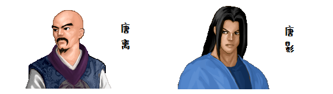

## 10楼

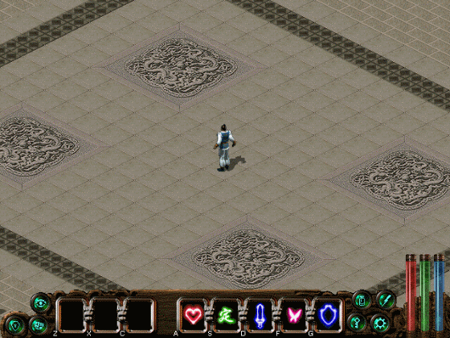 花飞蝶舞剑“”是翠烟门的女子剑法~（不可小瞧哦） 说到翠烟门可以说是美女如云啊，想在翠烟门找个姑娘回家的公子哥实在是太多了。 可想而知翠烟门是个多么吃香的“部门”，有的甚至违背师命放弃一切都要跑来翠烟门~ 翠烟门的女子个个武功精湛，美若天仙。 秋依水所托飞云送的信物已经交给了唐影，唐影这回也随飞云来到了翠烟门。 唐~秋的婚姻也算是尘埃落定了，倒是飞云被翠烟门的姐妹们档在门外。 飞云闯过了翠烟门的花魁阵，春兰、夏荷~等姐妹们才放过飞云 让他进入翠烟门~ 但在翠烟门并没有找到自己的小仙女~~ 事后秋依水也为了感谢飞云，就把翠烟门的秘传花飞蝶舞剑赠授于飞云防身。 “神马？给我一本女子剑法的秘籍” 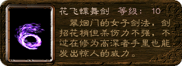 花飞蝶舞剑是很容易被武林人士忽视的武学~ 由于其剑招的花梢，而且在女子的手里很难发挥其强大的威力。 运气将内力聚集于剑刃之上，在空中划出一道蝶状剑气，击向他人。 此剑法也适合男子修炼，但并不会有多少男子会花心思去修炼女子剑法~ 此剑法并不会因为其男子阳刚内力而导致其剑气难以施展。 恰恰相反在内力高深的男子手里能够发出惊人的威力， 由于高深的内力并不会去改变其剑气的形态，而是会因内力的深厚， 常年的修炼，而产生剑气叠加效果。不仅不会影响形态，而且会得到乘倍数叠加的功力。 花飞蝶舞剑的剑气形态非常的幽美，其释放出不断旋转的螺旋~蝶状剑气， 就如围绕着美丽的花瓣环绕而飞的蝴蝶~舞动着我们的心灵。 翠烟门的女子让我们心动不已，而其剑法也让我们陶醉~ 在很多情况下，当发出如此美丽的剑气时，很容易让人陷入幻境而导致警惕心下降， 而受到不可挽回、抵挡的伤害。 不断旋转的蝴蝶剑气不仅美丽，而且可以在击出时保证其方位精确的舞动着~ 男子修炼时可以帮助男子获得更好的准心度~（可以弥补男子的粗心所导致的准心不足） 在高深的内力，和常年的练习。使其叠加的蝴蝶剑气更是不可抵挡~（最高10层叠加！~） 当受到第一波蝴蝶剑气时，其实就已经无法及时来防范即将到来的多重剑气。 如果男子能够坚持修炼，其威力是非常惊人的。 但又有多少男子会因为其女子剑法而最后 练就其花飞蝶舞的精髓呢？ =================================================================== 

## 11楼

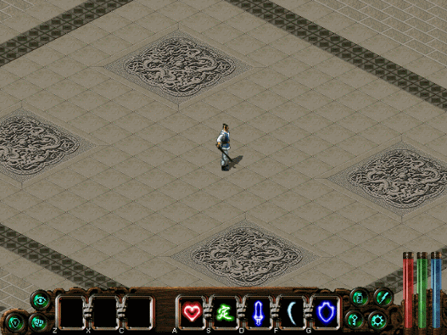 依风剑法“”是由南宫飞云的外公-天剑客南宫灭所创~！ 南宫灭是金国第一高手、宰相。从武功上来讲无法能够有人与之匹敌。 南宫灭与飞剑客张风一战之后~，便与独孤剑一战。 由于南宫灭的野心，激发了独孤剑使出了同归于尽的功夫。 最终倒在了天魔解体大法之下。 虽已至此，独孤剑也为此差点丧命。 我想作为南宫灭，唯有这毒辣的天魔解体大法才能降服于他。 作为金国第一高手所创的武学，依风剑法那更是威力相当！ 南宫飞云为了找小公主，坐船来到汉阳。 跳过船只，来到河道上方的墙角处。 找到了外公当年藏在这墙缝里的武林秘籍《依风剑法》。 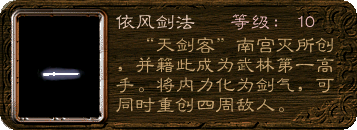 依风剑法，是非常强大的攻击群体的武学。 通过深厚的内力将其化为剑气，在其身体周围形成32道剑气 击向对方。 飞向对方的剑气速度如此之快，加上如此众多环绕其身的剑气，将很难躲避剑气的攻击。 当其内力深厚修为精湛之时，剑气将更加强劲锋利而坚韧。 只要被击中其中的一道剑气，哪怕是武林高手也已经深受重伤。 如果只是武林的泛泛之辈，可谓是直接一命呜呼~ ======================================================================== 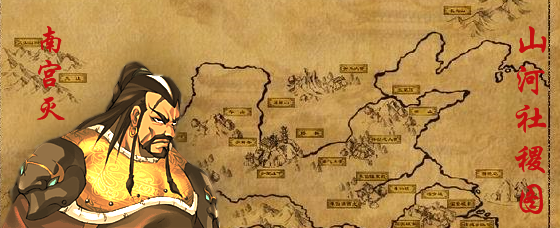

## 12楼

 大力金刚掌“”是少林武功中精湛的绝技~ 这种掌法极其刚烈，可以轻易的拍碎坚硬的岩石。 飞云来到汉阳后得知，楚天盟和天王帮的弟子发生了纠纷。 其实天王帮的弟子杀的是金人的探子，算是楚天盟七帮二十八派中汉阳帮的“弟子” 天王帮帮主杨瑛是飞云姑母的结拜姐妹，飞云拿着老爹留给他的天王令。 从楚天盟的史堂主手里救出了这位天王帮弟子， 并随天王帮弟子来到天王岛， 杨瑛的侍女苹儿告知飞云，杨瑛不在岛上，而且独孤剑一家早已在三年前襄阳战役中死去... 还说要调查飞云身份的真伪- -”... 当苹儿调查归来之后，告知飞云，由于得到独孤剑未死的消息，杨瑛已经赶往中都营救。 苹儿把帮主留下的大力金刚掌秘籍送给了飞云，希望能对飞云有所帮助~（还算有点良~心） 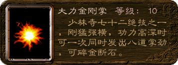 大力金刚掌是少林寺七十二绝技之一， 起初可以同时发出三道掌力，当修为高深以后可以同时发出强劲的八道掌劲。 和飞云当初自己所领悟的怒雷指如出一辙，但作为后者 所激发出的掌劲更加醇厚而且威力较大、方位精准。 虽然怒雷指的指劲更便于修炼，但急于求成的怒气会带来最后的偏离。 而作为大力金刚掌而言，则需要内外兼修。 不仅要注重内力，而且还需注重掌法。这样才能 稳、准、深。 这也是作为佛家的武学来讲，不伤及无辜就是胜造七级浮屠... =============================================================== 

## 13楼

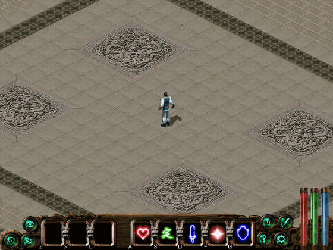 大梦心法“”据说此武学是大梦神君在梦中所创！ 所谓日有所思 夜有所梦，梦似思梦 想思似想。 南宫飞云，拿着苹儿获得的楚天盟弟子勾结金人探子的密函， 来到楚天盟，交给楚天盟堂主史忠良，来洗清天王帮弟子的清白。 史忠良召集楚天盟七帮二十八派各个帮派首领来总坛开会，制订消灭内奸的对策~ 但由于段家庄庄主段环山无恶不作，最近与金人有勾结。 为此史堂主已经派弟兄去打探段环山的虚实，以便找机会除掉他人。 但帮中弟兄一去不回，可能被段环山迫害。但帮中又出现内奸，这让史堂主难以脱身。 为此南宫飞云，来到段家庄除掉了恶霸段环山。（楚天盟的弟兄已遭不测..) 史堂主为报答飞云给弟兄们的报仇之恩，送上一式大梦心法作为谢礼~ 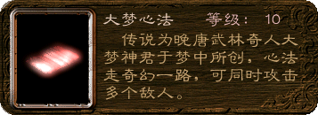 现实5分钟，梦境1小时， 梦中之梦为1周，三重之梦为一月。 当迷失于梦域里，则相当于数十载.... 作为武学，作为心法，我们又有多少个数十载来精通、来创造、来修练它们呢？ 人生如梦亦如幻， 梦君心法真奇幻。 唯有时间能刻画， 光阴逝去留永幻。 作为大梦神君的大梦心法，心法极为神奇亦幻。修炼者能够在极短的时间内激发强大的内力~ 从身体所激发的异幻内力，能够创造极广的攻击范围。 作为大梦心法，其实让我们更渗透的不是武学，而是时间。 时间刻画着一切，时间决定着一切。 当修炼者能够熟练掌握，这奇门心法的能力后，可以让人进去梦境，进入梦中之梦来创造自己的“可能”。 让它在短暂的时间里，创下更多的永恒... ====================================================================== 

## 14楼

 金刚不坏神功""自古以来，修得金刚不坏之身的人非常少！ 作为佛学,最讲究的是佛缘。 所谓有缘千里来相会,无缘对面不相逢 每一个众生的生命之中，都隐含著这亘古不易、不摧不坏的金刚之身，因此每一个众生都有资格修成，但必须完全而严格的依照佛学去修炼。 作为佛学,作为金刚般若波罗密经(金刚经),没有佛缘也是很难成大器的。 在中都遇见雪儿的飞云不知道有多开心~ 龙音寺巧遇雪儿,在两人交谈的时候却遭到了家丁的阻挠.与诺雪不辞而别 这下可急坏了飞云,来到中都的大街上寻找诺雪. 这个时候却看到很多人围在了欧阳府邸,却没有看到欧阳府的人。 只看到欧阳桐的师傅玄慈大师，打坐在梅花桩上面和其它人比试武功。 呵呵，比武的热闹飞云怎么可能会放过呢？飞云轻功一跃跳上梅花桩~ 玄慈大师看出飞云的根骨资质非常罕见，加上有高人指点，武功根基很好~ 大师在比武之前还出了个题要飞云回答，螳螂捕蝉黄雀在后... 飞云则认为应该顺其自然,救了蝉，螳螂饿死了，救了螳螂，小麻雀在窝里饿死了。 飞云赢了坐在梅花桩上一动不动的玄慈大师。 飞云：“诺是大师在梅花桩上移动，十个我也不是大师的对手，承让，承让。” 玄慈大师：“公子行事不依世俗，顺乎天理人伦，深得我心。加上武功根基不凡，将来必有造就。” 后来玄慈大师有一事相求,由于玄慈大师得知欧阳桐其实是个采花大盗。 但不幸遭到欧阳桐的暗算，中了剧毒。此时无法除掉少林叛徒，也无法活着回去向少林寺方丈禀报实情。 此时玄慈大师把金刚不坏神功传给飞云，希望飞云能够安全的抵达少林寺和方丈禀报情况。 飞云的性格大家清楚的，加上还在急着去寻找诺雪的家住哪儿。 哪有那么多时间跑去少林寺，于是飞云直接进入欧阳府邸的密道，将少林叛徒欧阳桐绳之于法~ 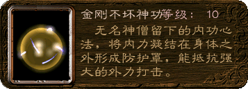 自古以来矛与盾之争都没有一个明确的结果。 有破盾之矛，就会有挡矛之盾。有矛就有盾谁也没有缺少过谁。 作为金刚不坏神功，是通过集结内力在体外形成一种内力防护罩，从而来抵挡强大的攻击。 内力越深厚能抵挡的攻击则越强。 雪一刀理所当然可以成为最强之矛，而金刚不坏神功则可以成为最强之盾。 作为谁是最强者 我想，这已经不是最重要的了。 而是如何把矛和盾更好的结合在一起，充分来发挥自己的优势~ 从而成为最强的矛盾。让“矛盾”不再矛盾！ ============================================================================ 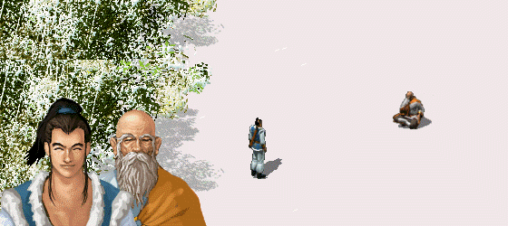

