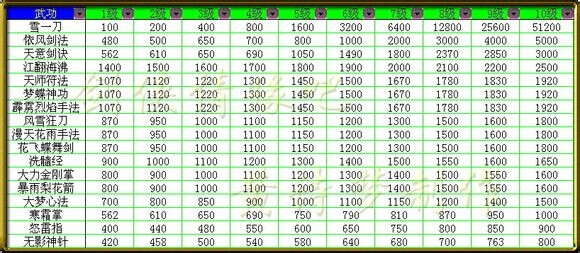
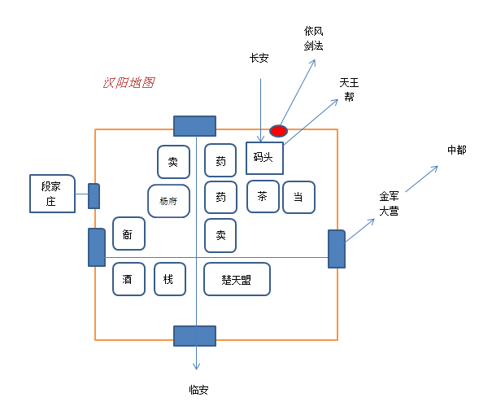
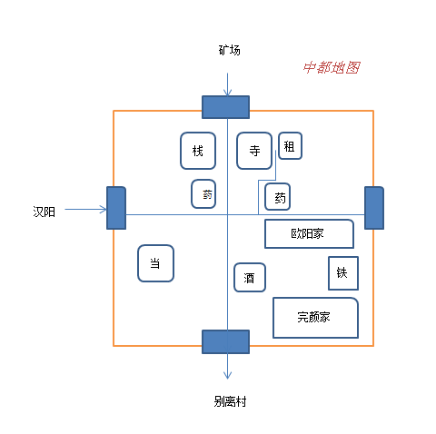

## 完美结局关键：

*[@剑心折手](https://www.jianshu.com/u/df1a9bdcf9dd)*

1、学百步定身法、依风剑法、雪一刀。（依风剑法升到顶，然后到金兵大营外围的精兵营地，把雪一刀升到顶）。

2、救出四位好友，存盘，多救几次。（救全四人有挑战）

3、武林大会秒败假独孤剑。（只有雪一刀，才能连胜十一场，没有他法）

4、天忍教秒杀完颜洪烈。（塔中的人用江翻海沸烧死他们）

## 武功图谱：

## 简易地图：

