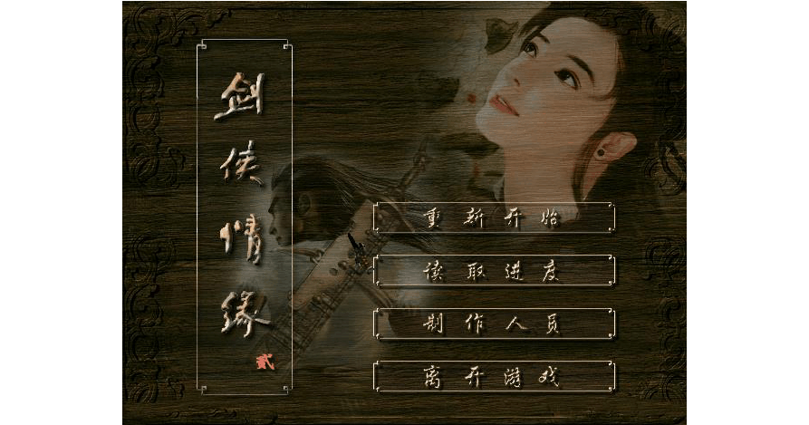
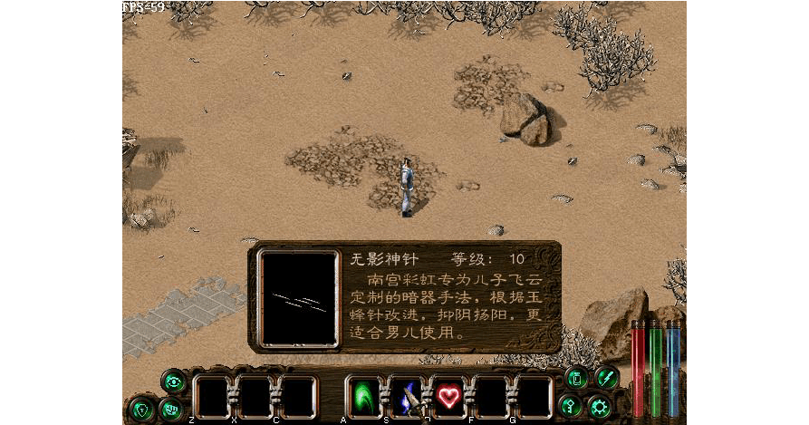
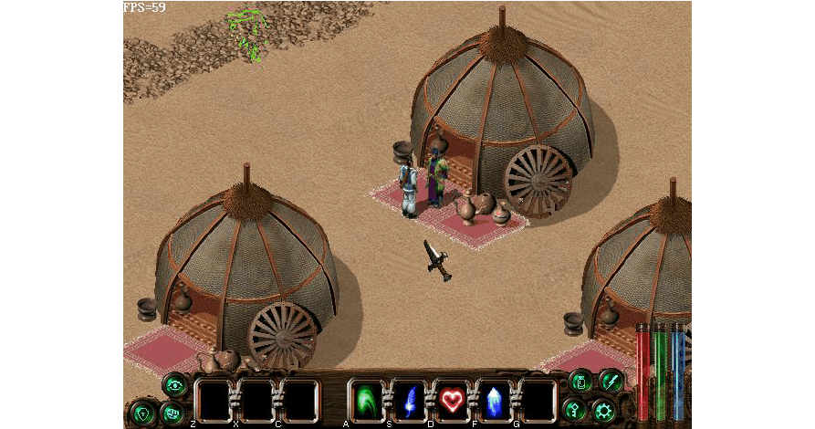
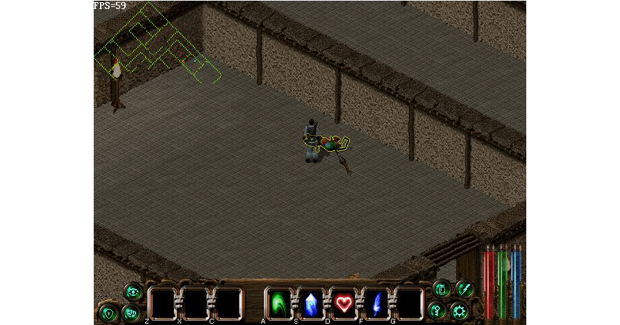
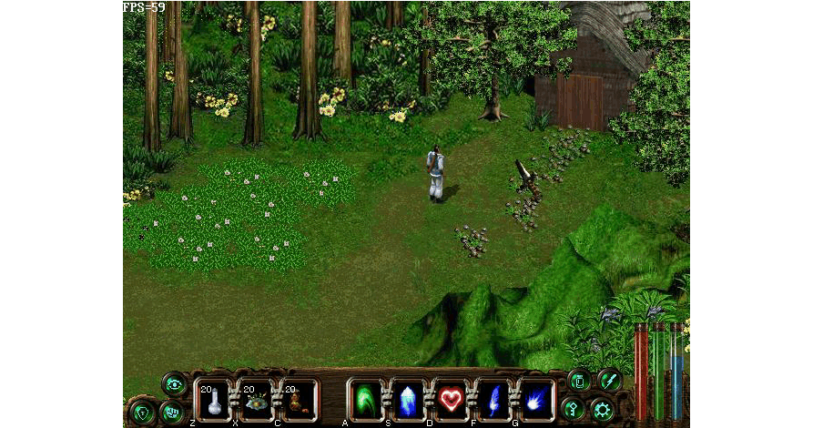
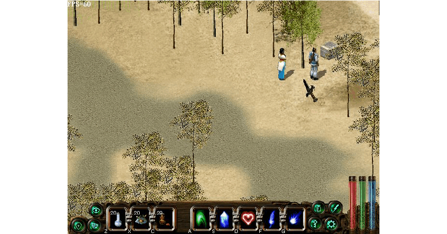
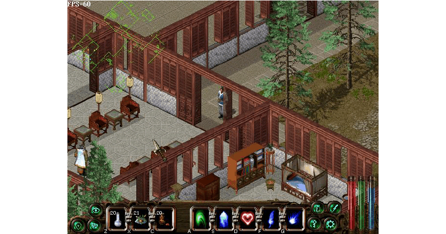

剑侠情缘2白金版史上最完整图文攻略

## 介绍

简要说明：本款游戏在当时可谓是一个经典之作，本攻略是在网络上现有的攻略基础上，再配以楼主的详细说明和插图所写，不论您是初玩还是回味经典，都希望本攻略能带给您帮助，若有不全之处也欢迎大家一起讨论补充。祝您游戏愉快！热键：F1 开/关主角状态窗口F2 开/关主角物品窗口
F3 开/关主角武功窗口F4 开/关选项设置窗口
ESC 开/关系统选单ENTER(回车) 使主角为于屏幕中心
SPACE(空格) 关闭所有打开的窗口
Q 切换当前武功（向前）
W 切换当前武功（向后）
Z .X .C 使用当前物品
A .S .D .F .G 设置使用当前武功
SHIFT+鼠标左键跑步前进
ALT+鼠标左键跳跃
CTRL+鼠标左键强制攻击
武功简介：这是网络上的武力排行图

注意一点，这里的数值是单元攻击力，比如楼主喜欢用的花飞蝶舞剑，虽然10级只有1800，不过每次发招的时候，大概有9-10个“连环套”，所以真正的攻击力在18000左右，威力惊人。从此图可以看到，初始武功只有天意剑诀排名靠前，建议开始重点练习。初始的单挑武功可以练习黑煞伯伯交给你的寒霜掌。这里简单推荐一下，单挑：雪一刀，花飞蝶舞剑，百步定身法（敌人不动，可以上去狂砍）；群攻：依风剑法（360度），天意剑诀。具体的武功从哪里学得下文会有介绍。

## 启程

由于只是介绍流程，所以楼主开了作弊，玩家们还是不要开了~~游戏中摁Tab键可以打开小地图（左上角），可以更清楚自己的位置。好了，开始吧！
开始就会的武功：天意剑诀，无影神针，白虹贯日

在家里与父母对话，一直到没有新内容为止，得到天王帮帮主信物“天王令”。之后与白煞对话学习江湖经验，与黑煞对话后他会教你“寒霜掌”。

自己从家里的箱子拿点东西后就下山吧，下山后可以选择难易度。选择容易的话，第一遍是不行的，系统会建议你选择困难，不过多走几次就可以了。楼主选择的困难。来到沙洲村。在这里可以买装备补给。

随后找村长谈话，知道前方是狂沙镇，过后南下即可到达中原，路上有野狼和一头火狼伤人
性命，于是你自告奋勇前去除狼。

在这个屋子里可以找到火狼。

杀死火狼后回去找村长谈话，村长会感谢你给你一些银子和一把桃花剑。

        

           

接着来到这里的地下废墟，可以杀人练级。（在这里可学得怒雷指）

注意，杀死人后，点击黄色部分可以得到一些银两（随机的）。

最后在这里杀死一个高手后可学会怒雷指。

点击圆圈可以返回入口处。沿着道路向下走可到达狂沙镇。

## 狂沙镇

来到镇上，可先自行逛逛，购买补给。来到客栈，进去后会与一书生（柴嵩）交谈，两人相谈甚欢，他也会教你一些江湖经验，然后怂恿你晚上到镇子东北的铁门寨去看打架。与客栈老板交谈歇息，晚上一觉醒来发觉睡过了头。

在这里出东门离开镇子，在野外干掉一些人后来到铁门寨，发觉竟然都是死人。

进入大厅可以发现奄奄一息的山寨头领，对方临死前让你去“后山百花谷放yan”。

来到后面，穿过虎穴，即可来到后山百花谷。

来到小屋。

发现一个被捆绑的小仙女。与之对话后去门口火堆处放烟，回来再与小仙女对话后，两人一起下山回到狂沙镇。

        

           

路上可以这个算卦的说话丰富剧情，你会调戏算卦的逗小仙女开心。

回到客栈休息一晚后，两人从南门离开来到小树林，这里右上角有宝箱。

来到龙门客栈，碰到书生，两人谈话后相约长安再见。

来到最里面的这个屋子，和里面人物说话，他告诉你他被抢了一万两银子，你答应帮他除掉山贼。

出龙门客栈向下走，在西面来到葬马岗。

这里有三个宝箱。宝箱里的东西都是随机出，建议先存档后再开，直到开出好东西。（以后也是这样）

大开杀戒后返回龙门客栈，那人自是千恩万谢。两人继续出发，南下来到树林。树林里你有感而发，令小仙女对你加深印象。

## 长安城

终于来到长安，找客栈老板谈话发现他和狂沙镇老板长得一模一样。原来是几兄弟开的连锁店。小仙女由于路途劳累先去休息，你则想到处走走。

来到这个小贩处对话，想买礼物送给小仙女，结果发现竟然是假货，小贩不得已告诉飞云对面杨府有杨贵妃用过的宝物夜明珠。

进入对面杨府，找杨七爷，但他不肯卖给你，正要离去时，杨七爷提出如果你能帮他夺回被抢走的玉圭，夜明珠甘愿送上。

        

           

来到府衙门口，找门口衙差打听消息，随后计上心来。

在此处用轻功跳入府衙。（按住Alt键，再用鼠标点击目的地即可）。

从这里进入密室。

这里有两个宝箱。

这里有三个宝箱，从中间箱子中即可拿到官印。

随后来到上官豹家，花言巧语后骗得玉圭。

返回杨七爷家，可得夜明珠。

欣喜若狂想给小仙女，回到客栈发现还没睡醒，于是来到酒店找书生。（现在不要返回上官豹家挑拨，因为事情还没败露呢）两人再次把酒言欢，得知书生名叫柴嵩。

返回客栈发现小仙女不见了，找掌柜询问得知被陌生人请走。回酒店找柴嵩帮忙，两人分头寻找。（此时上官豹处事情依然没有败露，所以先去找小仙女吧）。出酒店向西走，与路中青年谈话得知小仙女可能是城西风雪山庄庄主女儿赵无双。

## 风雪山庄

出西门最终来到风雪山庄。结果与守卫大打出手，最后被庄主赵升权一招风雪狂刀打败。（此

        

           
处无法还手，其实是诈败）醒来后和看守理论，赵无双出现，发现不是你要找的人，误会澄清。

刚要离去听到又有人闯庄，于是前去查看，原来是柴嵩，与赵无双郎情妾意套起近乎来。从赵无双口中得知小仙女有可能来自翠烟门。

顺着练武广场下的小道走，可来到一房间见到庄主赵升权。

与他对话可学会风雪狂刀。

回到长安，再次来到上官豹门口，发现一群人在看热闹，进去发现事情败露，再次挑拨二人关系后大打出手。

打完后点击上官豹，他会求饶并给你宝物。

出长安南门来到别离村。

