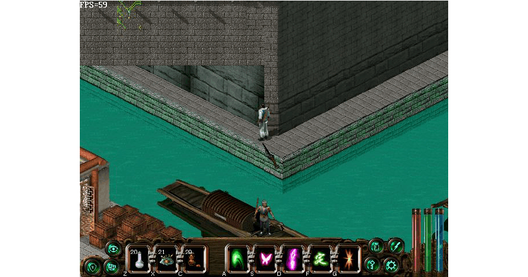

---
prev:
  text: 1-启程-长安城
  link: ../1-启程-长安城
next: 
  text: 3-中都-武林大会
  link: ../3-中都-武林大会
---

## 别离村

### 百步定身法支线

  <el-collapse>
    <el-collapse-item
      title="展开/收起"
    >
      

        进村得知村子东北的树林有武林人士出没。进村后沿着道路走会碰到分岔路，向东北方向走即可来到三岔路，从上方的门出去就到达武林人士出没的树林。
        
        
      

      

        进入树林后先向上走到头，再向右走，快走到头时会发现一个小男孩。（迷路的可查看左上角地图）领小男孩沿原路返回村子，他会给你一把钥匙。
        
        
      

      

        再次返回树林，在接小男孩地方的左下方有一个类似字母C的开口绿树林，进去后打开宝箱即可学会百步定身法。（这可是个很贱的武功，单挑时发招可让人不动，随后狂砍）
        
        
      

      

        
        
      

    </el-collapse-item>
  </el-collapse>

           
### 断案支线

  <el-collapse>
    <el-collapse-item
      title="展开/收起"
    >
      

        在村东的屋内见到县官在审案，飞云进去断了案子并戏弄了县官得到二百两银子。
        
      

    </el-collapse-item>
  </el-collapse>

从左下方的出口经野外来到翠烟门，一番谈话后门主秋依水让你讲一个盒子交到四川唐门的唐影手中。

## 唐门

出村东经山间小路来到唐门，却被骗入门内想要瓮中捉鳖。随时注意存档。一顿大打出手后打败唐门二公子唐潇（大厅中间，裤裙是黄色的，武功与其他人不一样，是漫天花雨手法），他会去请老爹。

最后只剩下两个老爷子。他俩打不死，此处必败。被打败后向他们解释个中缘由，随后将盒子交给唐影，原来盒子里是唐影送给秋依水的定情信物，两人因唐影父亲唐离的反对而无法获得认可。飞云不忿之下大胆放言，以自己父母的故事点化唐离，
化解了这一恩怨，成全了唐影和秋依水的亲事。

随后来到此处与唐影对话（右上边一点的一个房间里，很近的），他会感谢你并给你唐门秘笈。物品栏里点击右键即可学会漫天花雨手法。

## 翠烟门

将唐影带到翠烟门，无奈众姐妹还是不放过你…

打败春兰，即可破花魁阵

打败春兰后终于可以进入翠烟门寻找。在里面绕一圈，与所有人对话后（与五名女弟子说话即可，春兰、夏荷、射箭的女弟子不算在内，或者与符合条件的女弟子说五次话。）去找秋依水告辞，她会给你花飞蝶舞剑秘笈。此武功单挑很强。

返回别离村，遇到赵无双，告诉你柴嵩已经追踪某人去了中都，而小仙女可能与此人有关。到村南坐船去汉阳。

## 汉阳

来到汉阳，看见楚天盟和天王帮的人因为金人探子的事纠缠不清。

### 汉阳城地图

  <el-collapse>
    <el-collapse-item
      title="展开/收起"
    >
    

      
    

    </el-collapse-item>
  </el-collapse>

### 依风剑法支线

  <el-collapse>
    <el-collapse-item
      title="展开/收起"
    >
      

        先别上陆地，用轻功跳到后面，在里面的箱子里可学会很强的武功依风剑法。
        
        
        
      

      

        
      

    </el-collapse-item>
  </el-collapse>

### 练武场支线

  <el-collapse>
    <el-collapse-item
      title="展开/收起"
    >
      

        在城里可到楚天盟总堂下面的老孟武馆练功升级，可以来回练。
        
      

    </el-collapse-item>
  </el-collapse>

在下船附近的药店里可以买到很好的补给

来到楚天盟总堂，见到堂主史忠良，与史忠良说话，然后与上方看门的弟子说话，再与里面关着的天王帮弟子说话。这小子自动去了码头。

此时不要去别的地方，直接去码头，与天王帮弟子说话，到天王岛。

到天王岛，进大厅，与苹儿说话。

见到苹儿，她告诉你帮主杨瑛不在岛上以及你姑父独孤剑的故事，并让你到湖中心的迷宫练功。

跳到天王岛上的荷花池中间，点击梯子，下到天王岛地下迷宫。

## 天王岛地下迷宫

此处用轻功跳到湖中心的岛上，下去练功。

天王岛地下迷宫，是个木人阵。木人阵中有五个关键的宝箱，开启其中任何一个，即可按原路返回到地面交任务了。

里面有很多岛需要用轻功跳过去，有很多宝箱，可以收获一番，期间还可以从另一处楼梯上去，外面也有很多药物。

打开关键宝箱后即可离开木人巷，在屋内找到苹儿，告诉你由于得到独孤剑可能没死的消息，帮主已经前往中都营救。从苹儿处得到密函和天王令，并且可以学会大力金刚掌。

返回楚天盟，将密函交给史忠良，化解了楚天盟和天王帮的恩怨。

### 段家庄支线

  <el-collapse>
    <el-collapse-item
      title="展开/收起"
    >
      

        史忠良告诉你汉阳西面段家庄有古怪，你自告奋勇接下任务。杀死段环山后返回楚天盟，可得到一些银两并学会大梦心法。
        
        
        
      

    </el-collapse-item>
  </el-collapse>

## 金兵大营

出东门，经郊外来到金兵大营。此处是全游戏最好的练级的地方，大营是被一个大圈的围墙围起来的，杀死圈外的人获得的经验是圈内的5-10倍，并且可以来回穿越金兵大营反复练级。

来到雪地，老者告诉你通往中都的独木桥断了，于是你决定用轻功跳过去。顺利来到中都。

