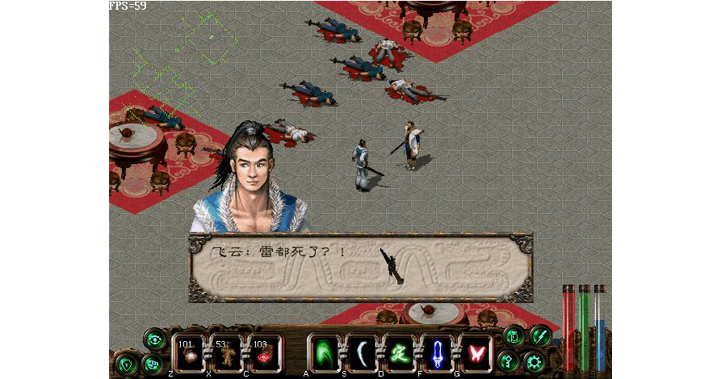

## 中都

进入中都，想到柴嵩喜欢喝酒，于是决定去酒店看看，到了酒店发现柴嵩不在，不过老板告诉你龙音寺有人看佳人。先不去龙音寺，来到欧阳桐的府邸，见到欧阳桐的师夫玄慈在摆擂台，上前迎战，获胜后玄慈有事相求。原来欧阳桐是个采花大盗，后来又让玄慈大师中毒，玄慈请你去少林寺通报消息，并在死前传你金刚不坏神功。（很有特点的武功，可阻挡敌人的攻击）

大师死后，你认为去少林寺耽误正事，自己又武功高强，于是决定自己去找欧阳桐算账。从欧阳桐府左上角入口进入地下室。

最后在地下室的右下角附近找到欧阳桐，杀死后救出两个女子，其中一个给你宝物，一个给你银两。

事后赶到龙音寺外，见到大群人围观，入寺查看，竟看到失踪多时的小仙女在大批随从的簇拥下在寺里祈祷，欣喜之下上前聊天，却被家丁拦住，一番折腾后追出寺外，小仙女不知去

        

           
向，不过看到迎面而来的柴嵩，让你去龙音寺后的房子谈话。

## 雪一刀

此时先不要去找柴嵩，返回龙音寺，寺里很多地方都有宝箱，容易出好东西。在寺旁的一个房间里和一个老太太说话，得知他的三个儿子均在矿山内做苦工，你决定搭救他们。（此任务一定要做，虽然不影响剧情，但是可以得到单挑神功雪一刀以及最好的剑---剑中之剑）

此处还有一个小去处，在龙音寺外正对面的大片客栈里，找到这样一个房间，里面的人看起来是武林中人，有一个宝箱，打开后里面的人会跟你拼命。

出中都北门来到野外。

在野外的右上方有一个宝箱，打开可学会最强单挑武功雪一刀。（后来的武林大会及终极大boss用此武功都是一招毙命）

来到矿山后大开杀戒，此处一定注意，里面有很多矿工，不要随便和他们说话，因为和其中一个说话后所有旷工就都逃走了。右上方有很多架子，杀死守卫后来到这个最长的架子旁，用轻功跳上去，和最里面的旷工（看不到，用鼠标可以感知到）说话，他会给你一块奇石。

然后所有旷工就都逃命去了。回到中都后，先到老太太那里，发现老太太不见了，可能和失散的儿子回家了，你感觉自己做了件好事，并祈求保佑自己和小仙女。

        
## 剑中之剑
           

随后来到铁匠铺，不太容易找到，在中都的右上方附近，欧阳桐府宅再往右上方走。

在找老板谈话前，建议先把银子全花光，因为等会老板会要你身上所有的银子。（方法，此前先把几乎所有的银子都买贵重的物品或药品，之后再去当铺卖就行了）与老板谈话后，即可得到剑中之剑。（无价之宝）

## 龙音寺

终于可以去龙音寺后找柴嵩了，得知小仙女就住在城内的一个大宅院内，柴嵩尽心尽力帮你办事，你纠结是否告诉他自己的真实身份，柴嵩走后，你过意不去，决定去酒店找柴嵩表明身份。酒店里不见柴嵩，于是向老板买了一坛好酒返回寺后小屋，向柴嵩表明身份后他很理解你的做法，并且没有强迫你抗金。

一夜过后，在城内寻找小仙女住的大宅院，找到后用银两打点守卫，但还是不能进入，正要离去时，小仙女的婢女婕儿出现，让你晚上到后花园见面。晚上，顺着围墙走，在这个缺口处用轻功跳进去，再用轻功跳过池塘后便可见到朝思暮想的小仙女。

此后便开始了甜蜜的约会。第一晚小仙女知道你为了她跋山涉水而大为感动，并告诉你她叫燕若雪，也知道了你的名字是南宫飞云。第二晚你把夜明珠送给了她并告诉了她事情的来龙去脉。之后谈到了金人和汉人的纷争并知道了她母亲很早就去世了，因为父亲很忙也很少和父亲见面。第三晚两人交流起开心的事。你告诉她黑白双煞是如何变为你家的仆人以及你是怎么欺负他们的，而她则怀念小时候骑马在雪野奔驰的感觉。第四晚你想让她白天出去四处走走，但她说她时时刻刻都会被强制保护，哪里也去不了。随后她又勉励你为防止宋金两国的战争而有所作为。回到居所后，柴嵩意外出现，告诉你你们两个人不会有好结果，因为若雪的父亲是金国重臣，唯一的办法就是带她私奔。于是你和柴嵩再次趁夜入府，却被家丁发现。柴嵩把若雪主仆带走并约定临安再见。你一路杀出中都，直奔临安。

        
## 回汉阳
           

去临安要先返回汉阳，于是从中都西门经野外再次跳跃悬崖，后穿越金兵大营经郊外返回汉阳。

从汉阳的南门出去，来到稻香村，看到三人比武，一番较量及交谈后三人离去，学会天师符法。

## 临安

一直向东走可穿过稻香村来到临安。来到临安后，一直向前走，走到头后向右前方走，在城东尽头处便是柴嵩的家。与门口婕儿对话后，入左边厢房找到若雪，两人终于相聚。到右侧厢房与柴嵩交谈后两人相携游西湖。

回来后，柴嵩告诉你你的姑父独孤剑在城外的凤池山庄等你，于是你和他一起赶往凤池山庄。出临安南门来到凤池山庄，但独孤剑对你的态度颇为冷淡。在认识了一些武林人士后决定回去找若雪。打点一下门口的守卫，回到临安见到若雪，善解人意的若雪又将你劝了回去。走之前与右厢房的柴嵩对话可学得梦蝶心经。

返回山庄后，从左侧的旁门进入，回到你的房间休息一夜。第二天刚起床就跑去找若雪（还得从旁门走），到若雪房间发现主仆二人在玩捉迷藏，先到右侧池塘处转转，回到大厅后去左侧若雪的房间，发现没有后再到外面的左侧可以找到婕儿，对话后返回池塘即可找到若雪。（不行的话多转几圈就行了）随后返回山庄，独孤剑要你去灭掉霹雳堂，与庄主邵骑风对话可学会暴雨梨花箭。

        
## 霹雳堂
           

先回到临安，可以去找若雪，跟她说有事情要办，她会让你小心点。出临安返回稻香村，从村子的南面进入霹雳堂，在里面的大厅见到大堂主雷同，将其打败后询问雷都的下落，才知道雷都早在两年前就死了，独孤剑早知道此时却没有通知你，这让你十分困惑。雷同自杀后，从他身上可找到秘笈学会霹雳烈焰手。

## 武林大会

返回山庄后，提出想去找朋友玩得到了允许，于是去找若雪，两人再游西湖。回来后去右面池塘处找柴嵩谈心，柴嵩说起自己的心事。这是婕儿通知你有朋友来看你，原来是唐影和秋依水，秋依水夸赞若雪长得标致。接着赵无双也找上门来。于是柴嵩做东，一众少年英雄相会，玩了数日。转眼到了中秋武林大会，因起晚返回山庄时大会已经开始，最后决定靠武功
决定武林盟主。你自告奋勇替姑父独孤剑上阵，接下来连赢赵无双，秋依水，唐影，老孟，柴嵩，杨干，邵骑风，史忠良，唐离以及赵升权共十场，最后和独孤剑对决。（注意，独孤剑使的是洗髓经，一招你就死了，所以尽量在他发招前先用金刚不坏神功护体或者先用百步定身法把他定住。）所有的对手用10级的雪一刀都是一招毙命。如果你输了自然是姑父当武林盟主，如果你赢了会有人推荐你来当，但你不感兴趣又推给了你姑父，总之最后盟主是独孤剑。

